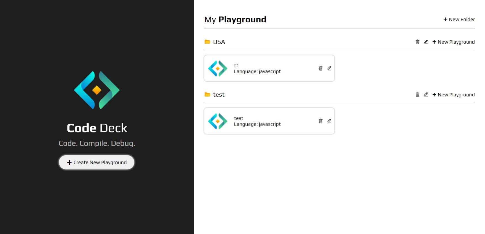

---
## **Code Deck | An Online IDE**

## **Project Overview**
**Code Deck** is an online Integrated Development Environment (IDE) that enables users to create, edit, and run code snippets in multiple programming languages. It also supports code sharing, theming, and local playground storage, making it an ideal tool for coding enthusiasts and learners.

---

## **Features**
1. **Playground Creation**: Create and save multiple code snippets.
2. **Multi-Language Support**: Execute code in languages like C++, Python, Java, and JavaScript.
3. **Code Editor**: Built using ReactJS with the CodeMirror package for syntax highlighting and editing.
4. **Flexible Layout**: Implemented with styled-components for responsive and customizable UI.
5. **API Integration**: Uses Judge0 API for online compilation and execution.
6. **Multi-Theme Support**: Switch between different editor themes.
7. **Code Upload and Download**: Import code files and export completed snippets.
8. **Input and Output Console**: Upload input files and download output results.
9. **Local Storage**: Save playgrounds locally for future reference.
10. **Fullscreen Mode**: Focus on coding with a fullscreen editor.

---

## **Technologies Used**
- **Frontend**: React.js
- **Styling**: Styled Components
- **Compiler Integration**: Judge0 CE API (via Rapid API)
- **API Calls**: Axios
- **Routing**: React Router

---

## **Screenshots**

---

## **References and Resources**
- [Judge0 CE API Documentation](https://ce.judge0.com/)
- [Styled Component Documentation](https://styled-components.com/docs/basics)
- [CodeMirror Documentation](https://uiwjs.github.io/react-codemirror/)
- [Vercel](https://vercel.com/) for hosting.

---

